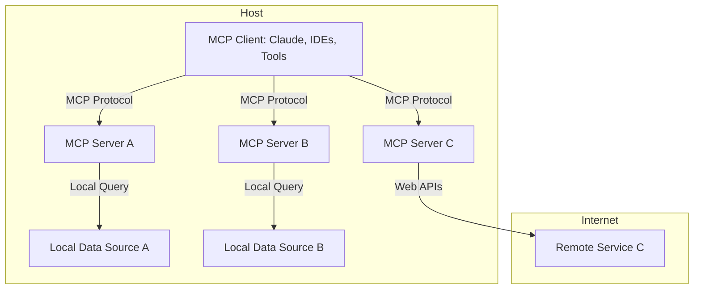

Access to external knowledge plays a crucial role in improving LLM responses in modern AI workflows. But managing context efficiently, ensuring communication between AI agents, and scaling tools to work together is non-trivial. This is where Model Context Protocol (MCP) comes in.

The [Model Context Protocol](https://www.anthropic.com/news/model-context-protocol) is an open standard that enables developers to build secure, two-way connections between their data sources and AI-powered tools. The architecture is straightforward: developers can either expose their data through MCP servers or build AI applications (MCP clients) that connect to these servers. An MCP server acts as a bridge between AI models and external data stored externally, for example, in an Elasticsearch vector store.

In this post, we'll explore:

- What an MCP server is and how it works.
- How MCP simplifies RAG and enables agentic workflows.
- A guide to building an MCP server to semantically search data from Elasticsearch.
- A hands-on demo using MCP Inspector and Claude Desktop App (which implements the MCP client protocol).

## What is Model Context Protocol (MCP)?

Model Context Protocol defines a structured way for AI models to request [information](https://modelcontextprotocol.io/docs/concepts/resources), execute [tools](https://modelcontextprotocol.io/docs/concepts/tools), and persist context across interactions (read more in the [official docs](https://modelcontextprotocol.io/introduction)). It standardizes communication between:

- **MCP Clients** (Chatbot apps, AI assistants) that **request** information or **call tools** on user's behalf.
- **MCP Servers** (search tools, databases, external APIs) that **respond** with relevant data or perform actions.

Unlike traditional RAG-based setups, which only retrieve documents, MCP enables AI to orchestrate and execute workflows, by calling multiple tools exposed via one or more MCP serves.

<FullWidthBackgroundContainer>

### MCP Architecture



</FullWidthBackgroundContainer>

## Why Use an MCP Server for RAG with Elasticsearch?

Semantic search enhances traditional keyword-based search by understanding **context and intent**. By integrating **an MCP server with Elasticsearch**, we unlock:

- **More accurate search results** – MCP allows AI models to select a specialized search tool or even dynamically create structured queries beyond simple keyword matching.
- **Dynamic agent workflows** – AI can call APIs, filter responses, and trigger actions based on real-time data.
- **Multi-tool integration** – MCP lets AI interact with multiple data sources, combining search with real-time insights.

## Building an MCP Server

Let's build an MCP Tool that allows you to semantically search across the [Elastic Search Labs](https://www.elastic.co/search-labs) blogs. The assistant will be able to use this tool depending on the user's intent.

I prepared a [demo repo](https://github.com/jedrazb/elastic-semantic-search-mcp-server) that's a good starting point to crawl an example dataset, embed the crawled content with [semantic_text](https://www.elastic.co/guide/en/elasticsearch/reference/current/semantic-text.html) mapping, and expose the tool to semantically search the data via an MCP server.

You can easily adapt this to your own use case by following the steps below, or looking at the repo's [README](https://github.com/jedrazb/elastic-semantic-search-mcp-server/blob/master/README.md) for more details.

### Crawl Blog Data and Generate Embeddings in Elasticsearch

To support semantic queries, we will use `semantic_text`, a specialized mapping that performs chunking and embedding for us once data is ingested into an index.

Create an index where we will store the data:

```bash
PUT search-labs-posts
```

Update the mappings. The Elastic Open Crawler by default populates website content into the `body` field:

```bash
PUT search-labs-posts/_mappings
{
  "properties": {
    "body": {
      "type": "text",
      "copy_to": "semantic_body"
    },
    "semantic_body": {
      "type": "semantic_text",
      "inference_id": ".elser-2-elasticsearch"
    }
  }
}
```

Note: `.elser-2-elasticsearch` is a preconfigured inference endpoint in ES. It will be used by `semantic_text` mapping to generate sparse embeddings for content that is chunked automatically.

I'm using [Elastic Open Crawler](https://github.com/elastic/crawler) to quickly populate data into Elasticsearch.

You should follow the exact [steps listed in the demo repo](https://github.com/jedrazb/elastic-semantic-search-mcp-server/blob/master/README.md#crawling-search-labs-blog-posts). It will guide you to put correct ES credentials into the crawler config in `crawler-config/elastic-search-labs-crawler.yml`.

Once crawelr is configured, running the single crawl will be just:

```bash
docker run --rm \
  --entrypoint /bin/bash \
  -v "$(pwd)/crawler-config:/app/config" \
  --network host \
  docker.elastic.co/integrations/crawler:latest \
  -c "bin/crawler crawl config/elastic-search-labs-crawler.yml"
```

### MCP Server Tool to Search Relevant Blog Posts

Once you populate the `.env` file with `ES_URL` and `API_KEY`, you can start interacting with our MCP server via the MCP Inspector tool.

The development is very straighftorward, thanks to [MCP Python SDK](https://github.com/modelcontextprotocol/python-sdk). Here is all we need, less than 50 lines of code!

```python
import os
from dotenv import load_dotenv
from elasticsearch import Elasticsearch
from mcp.server.fastmcp import FastMCP

# Load environment variables
load_dotenv()

# Setup Elasticsearch client
es_client = Elasticsearch(os.getenv("ES_URL"), api_key=os.getenv("API_KEY"))

# Initialize FastMCP server
mcp = FastMCP("Search Labs Blog Search MCP", dependencies=["elasticsearch"])


@mcp.tool(
    name="search_search_labs_blog",
    description="Perform a semantic search across Search Labs blog posts for a given query.",
)
def search_search_labs_blog(query: str) -> str:
    """Returns formatted search results from Search Labs blog posts."""
    results = es_client.search(
        index="search-labs-posts",
        body={
            "query": {"semantic": {"query": query, "field": "semantic_body"}},
            "_source": ["title", "url", "semantic_body.inference.chunks.text"],
            "size": 5,
        },
    )

    return "\n\n".join(
        [
            f"### {hit['_source']['title']}\n[Read More]({hit['_source']['url']})\n- "
            + "\n- ".join(
                chunk.get("text", "")
                for chunk in hit.get("_source", {})
                .get("semantic_body", {})
                .get("inference", {})
                .get("chunks", [])[:3]
            )
            for hit in results.get("hits", {}).get("hits", [])
        ]
    )


if __name__ == "__main__":
    print(f"MCP server '{mcp.name}' is running...")
    mcp.run()

```

To run the development inspector, simply call:

```bash
make dev
```

It will open the inspector on `http://localhost:5173`, where you can interact with the MCP server via the protocol in the UI.

<ImageComponent
  image={props.data.mdx.frontmatter.blogImages[0]}
  alt="MCP Inspector"
/>

### End-to-End Demo with Claude Desktop App

Claude Desktop App implements the MCP Client interface. You can add our MCP server to your local Claude Desktop by running:

```bash
make install-claude-config
```

This updates `claude_desktop_config.json` in your home directory. On the next restart, the Claude app will detect the server and load declared tools.

Here's an example of Claude dynamically looking up a blog post about `semantic_text`:

<ImageComponent
  image={props.data.mdx.frontmatter.blogImages[1]}
  alt="Claude MCP Client"
/>

<ImageComponent
  image={props.data.mdx.frontmatter.blogImages[2]}
  alt="Claude MCP Client"
/>

This is just a starting point. We can add more tools, like a generic Elasticsearch query tool, or even spin up more MCP servers to expose additional capabilities. The real power comes from **orchestrating them together**.
