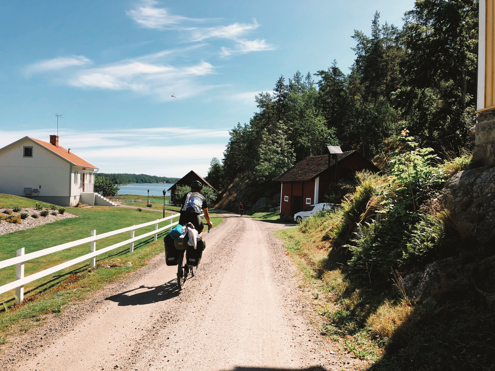
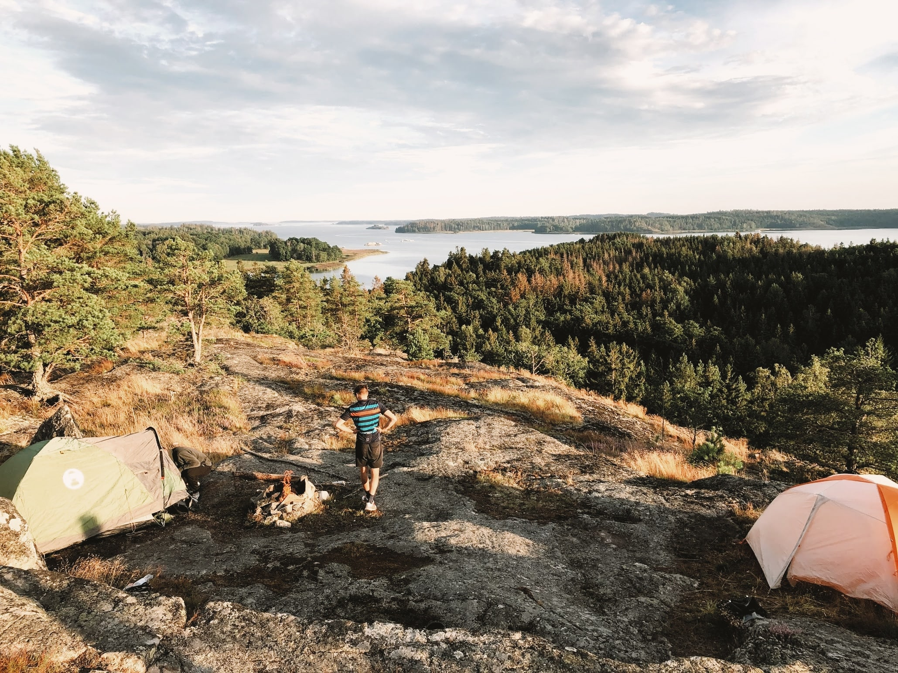

* [Route Profile](#route-profile)
* [Wild Camping](#wild-camping)
* [Photos](#image-gallery)
* [GPS Route and Camping Spots](#gps-route-and-camping-spots)

Earlier this summer my friends and I packed our bikes, took a train to Gdańsk and boarded a ferry headed to Nynäshamn, Sweden. After an 18 hour long cruise our Swedish bike packing adventure had begun.

We cycled along [EuroVelo 10](https://en.eurovelo.com/ev10) - the Baltic Sea Cycle Route. It follows endless tarmac and gravel roads along the Baltic see. The Swedish coastline takes in beaches, cliffs, woodland, ports and marinas as well as countless large and small islands - a dream scenery for any bikepacker. On this journey, we've lost count how many times we had stopped to swim in the warm summer lakes and colder Baltic see. Also, with Allemansrätt, a Swedish law that allows everyone to roam and camp where you please, we had been spoilt with campsite choices. Quite a few times friendly locals helped us with finding the camping spots.

## Route Profile

We followed EuroVelo 10 - Baltic Sea Cycle Route, southwards from Stockholm, the country’s vibrant capital, to Malmö, going most of the time along the see.

We cycled from Stockholm (Nynäshamn port) to Ystad, the point of departure of our ferry headed home. The bikepacking journey took us 8 days. We averaged the distance of roughly 115km a day. The route was **hilly** with many short up- and downhills, for the first 4 days we were averaging more thn 1000m elevation gain per day. It was quite straining especially when cycling on a fully loaded bike - we carried around 20kg of equipment and supplies. The route became progressively flatter and easier as we got near Kalmar and Karlskrona. The wind was not a big problem as for the majority of the route we were rode covered by trees.

A gravel bike is advisible as much of the route leads along gravel and tarmac roads. 35mm-42mm tyres worked great for us.

Some stats from Strava:

| Total distance | Total elevation | Time      |
|----------------|-----------------|-----------|
| 895km          | 5903m           | 41h 52min |

## Wild Camping

[“The Everyman’s Right”](https://en.wikipedia.org/wiki/Freedom_to_roam) in Sweden allows people to camp anywhere in the wilderness as long as it is not private property. It makes bikepacking quite affordable in an otherwise expensive country. We were wild camping for 8 days, usually very close to the Baltic sea or some lake. You trade views and proximity to the Swedish nature for the lack of utilities like showers or toilets. Though, swimming in the lakes and having access to bathroom at gas stations can make up for all the pains.

Sweden has also a big range of [wilderness shelters](https://www.gone71.com/shelters-in-sweden/) throughout the country. It is possible to spend the night there completely for free. Usually, you will find there an open fireplace, tables and benches. We were told by local people that it is fine to set up the tent next to the hut. In a cold, windy night the hut might not be enough to protect you from the wind.

<image-gallery></image-gallery>

## GPS Route and Camping Spots

<iframe src="https://ridewithgps.com/embeds?type=route&id=38399851&metricUnits=true&sampleGraph=true" style="width: 1px; min-width: 100%; height: 700px; border: none;" scrolling="no"></iframe>

| GPS trace                                             | Camping spot                                                                                                                                                                                             |
|-------------------------------------------------------|----------------------------------------------------------------------------------------------------------------------------------------------------------------------------------------------------------|
| [Day 1](https://www.strava.com/activities/3884215700) | We spent the night near Tullgarn on a rocky hill. Amazing spot with views. You have to leave the bike at the bottom and carry your equipment on foot: [approximate GPS location](https://bit.ly/2FVUD3L). |
| [Day 2](https://www.strava.com/activities/3889586064) | Camped at Ensjön lake.                                                                                                                                                                                   |
| [Day 3](https://www.strava.com/activities/3893201117) | Camped near Gamleby at the seaside.                                                                                                                                                                      |
| [Day 4](https://www.strava.com/activities/3898173911) | We finished near Oskarshamn, camped at the seaside. It's quite hard to find a good spot close to the city. It's better to go a bit further away.                                                         |
| [Day 5](https://www.strava.com/activities/3903372251) | Camped in the forest near Torsås.                                                                                                                                                                        |
| [Day 6](https://www.strava.com/activities/3907739263) | Camped in the shelter in Järnavik: [approximate location](https://www.google.com/maps/dir//56.174592000000004,15.079513000000002).                                                                        |
| [Day 7](https://www.strava.com/activities/3912610094) | Camped in the shelter in Kivik: [approximate location](https://www.google.com/maps/dir//55.6865063,14.2337752/@55.6765303,14.0841077,12z).                                                                |
| [Day 8](https://www.strava.com/activities/3916179399) | Night on the ferry 🛳                                                                                                                                                                                    |

