* [Route profile](#route-profile)
* [Wild camping](#wild-camping)
* [Detailed Route Stages](#detailed-route-stages)
* [Photos](#photos)

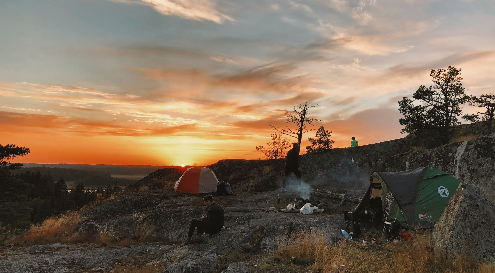

Earlier this summer my friends and I packed our bikes, took a train to Gdańsk and boarded a ferry to Sweden. After an 18 hour long cruise to Nynäshamn, our Swedish bike packing adventure had begun. 

We cycled along [EuroVelo 10](https://en.eurovelo.com/ev10) - the Baltic Sea Cycle Route. It follows tranquil tarmac (80%) and gravel (20%) roads along the Baltic coastline. Often there is a separate cycling path along the normal roads. The Swedish coastline takes in beaches, cliffs, woodland, ports and marinas as well as countless large and small islands - a dream scenery for every keen bikepacker. Swedes are very kind nation, seeing people waving and cheering at us was not uncommon. Cars were overtaking with extra care. Also, everyone spoke very good English which was handy when asking around for cool wild-camping spots.

## Route Profile

Along this stage of EuroVelo 10 - Baltic Sea Cycle Route, you follow the Swedish coastline southwards from Stockholm, the country’s vibrant capital, to Malmö - the third-largest city in Sweden.

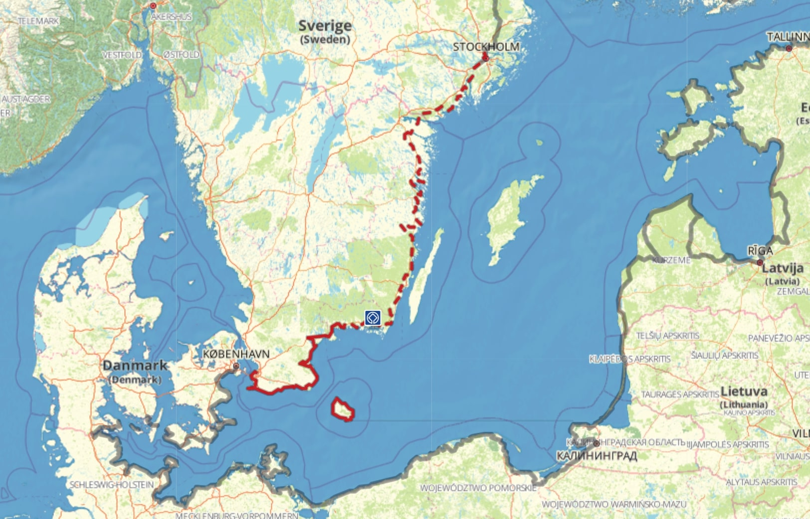

We cycled from Stockholm to Ystad, since our return ferry was departing from there. The bikepacking journey took us 8 days and we averaged the distance of 115km a day. The route was **hilly** with many short up- and downhills. It was quite straining especially when cycling on a fully loaded bike - we carried around 20kg of equipment and supplies. The route became progressively flatter and easier as we got near Kalmar and Karlskrona. The wind was not a big problem as for the majority of the route we were covered by trees. 

Some stats from Strava:

| Total distance | Total elevation | Time      |
|----------------|-----------------|-----------|
| 895km          | 5903m           | 41h 52min |

## Wild Camping

[“The Everyman’s Right”](https://en.wikipedia.org/wiki/Freedom_to_roam) in Sweden allows people to camp anywhere in the wilderness as long as it is not private property. It makes bikepacking quite affordable in an otherwise expensive country. We were wild camping for 8 days, usually very close to the Baltic sea or some lake. You trade views and proximity to the Swedish nature for the lack of utilities like showers or toilets. Though, I think that bathing in the lakes and regularly visiting bathrooms at gas stations can make up for all disadvantages.

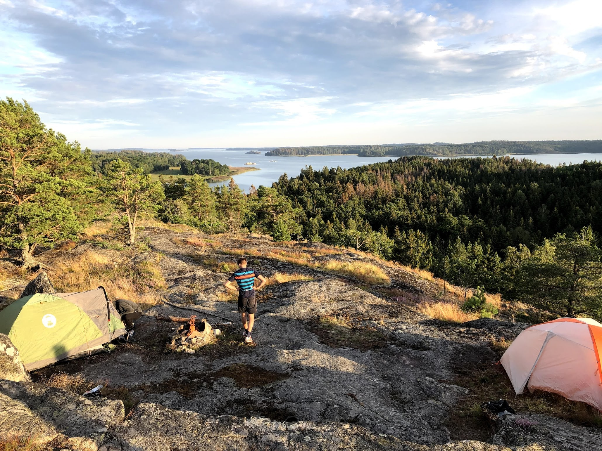

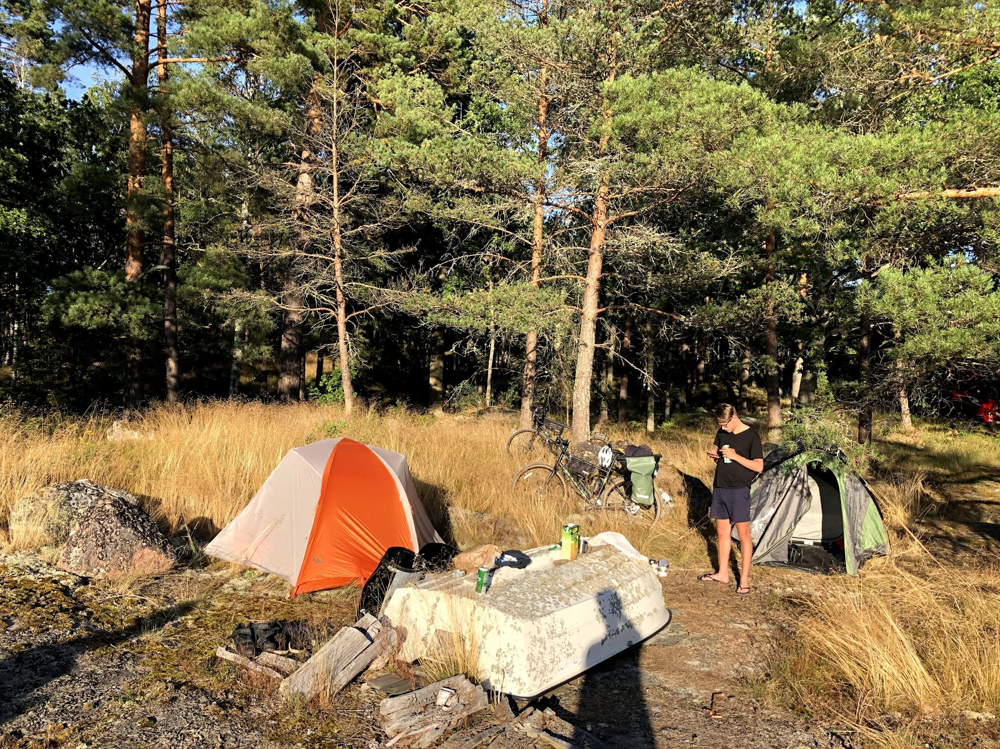

Sweden has also a big range of [wilderness shelters](https://www.gone71.com/shelters-in-sweden/) throughout the country. It is possible to spend the night there completely for free. Usually, you will find there an open fireplace, tables and benches. We were told by local people that it is fine to set up your tent next to the hut. In a cold, windy night the hut might not be enough to protect you from the wind.

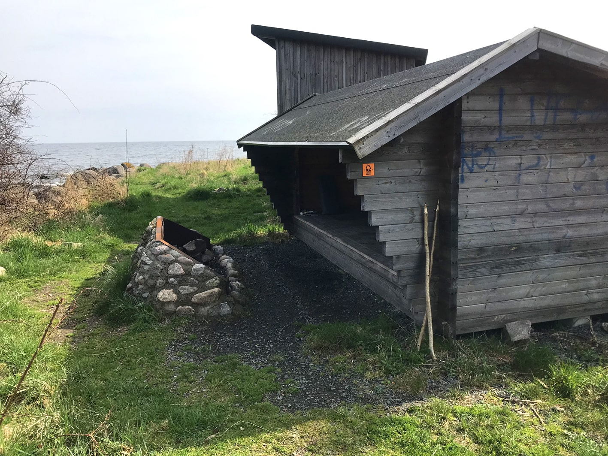
*Wilderness shelter in Kivik.*

## Detailed Route Stages

| GPS trace                                             | Camping spot                                                                                                                                                                                             |
|-------------------------------------------------------|----------------------------------------------------------------------------------------------------------------------------------------------------------------------------------------------------------|
| [Day 1](https://www.strava.com/activities/3884215700) | We spent the night near Tullgarn on a rocky hill. Amazing spot with views. You have to leave the bike at the bottom and carry your equipment on foot: [approximate GPS location](https://bit.ly/2FVUD3L). |
| [Day 2](https://www.strava.com/activities/3889586064) | Camped at Ensjön lake.                                                                                                                                                                                   |
| [Day 3](https://www.strava.com/activities/3893201117) | Camped near Gamleby at the seaside.                                                                                                                                                                      |
| [Day 4](https://www.strava.com/activities/3898173911) | We finished near Oskarshamn, camped at the seaside. It's quite hard to find a good spot close to the city. It's better to go a bit further away.                                                         |
| [Day 5](https://www.strava.com/activities/3903372251) | Camped in the forest near Torsås.                                                                                                                                                                        |
| [Day 6](https://www.strava.com/activities/3907739263) | Camped in the shelter in Järnavik: [approximate location](https://www.google.com/maps/dir//56.174592000000004,15.079513000000002).                                                                        |
| [Day 7](https://www.strava.com/activities/3912610094) | Camped in the shelter in Kivik: [approximate location](https://www.google.com/maps/dir//55.6865063,14.2337752/@55.6765303,14.0841077,12z).                                                                |
| [Day 8](https://www.strava.com/activities/3916179399) | Night on the ferry 🛳                                                                                                                                                                                    |
## Photos

*Packed and ready to go.*

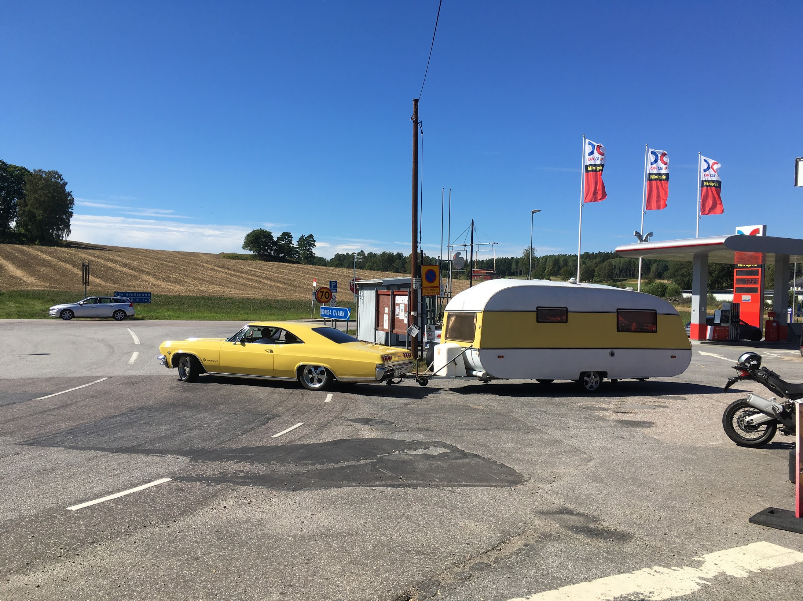
*Swedes do have a taste in cars.*

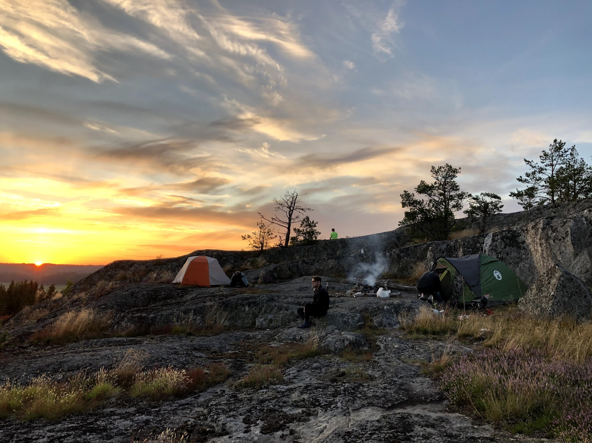
*Cool camping spot on a rocky hill.*

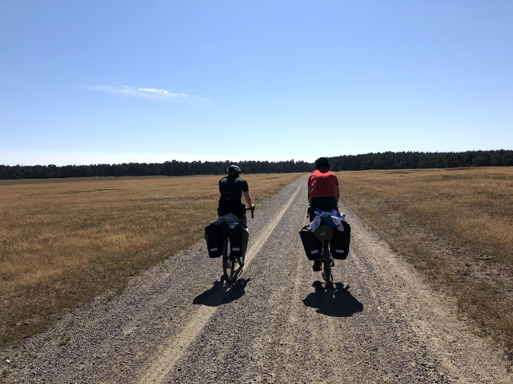
*Endless gravel.*

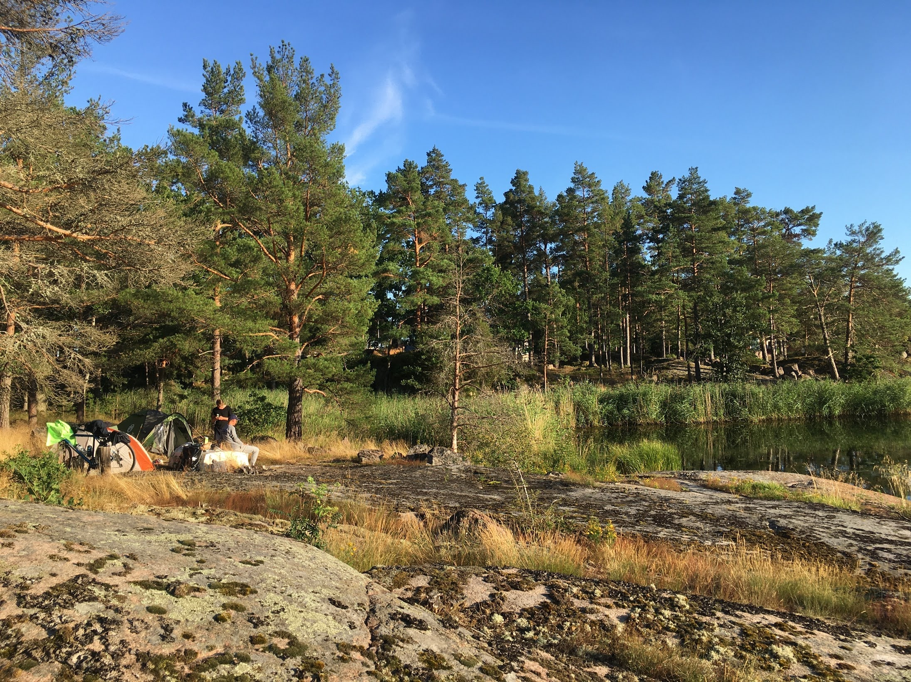
*Another camping spot at the seaside.*

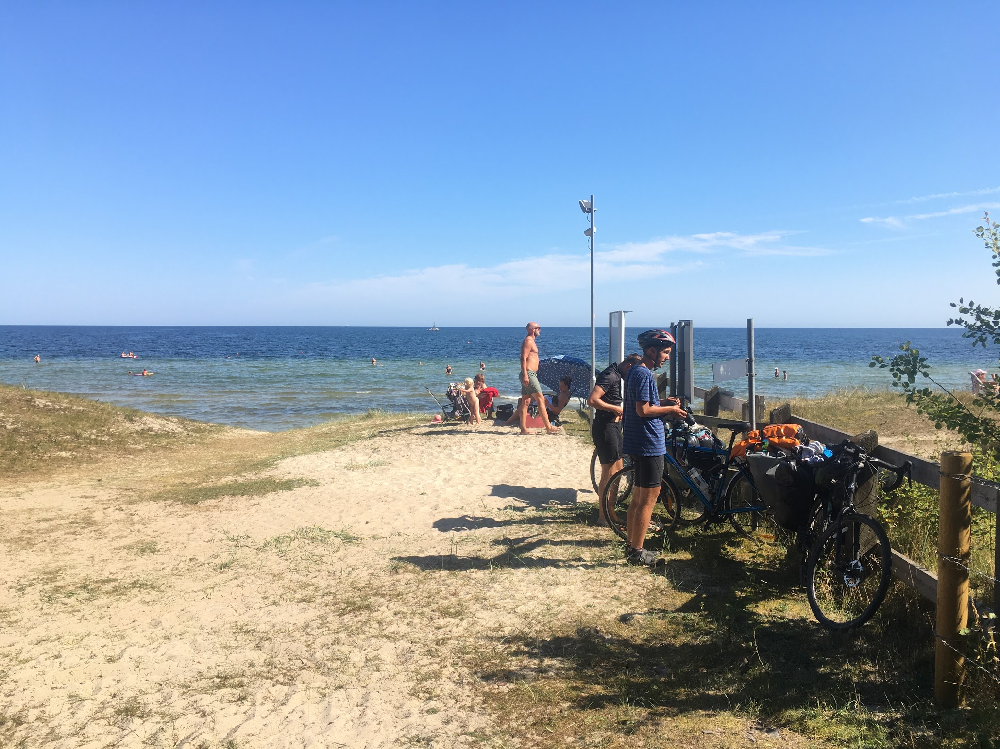
*Break on the beach.*

*Camping in the forest. A moose passed by our tent at night.*

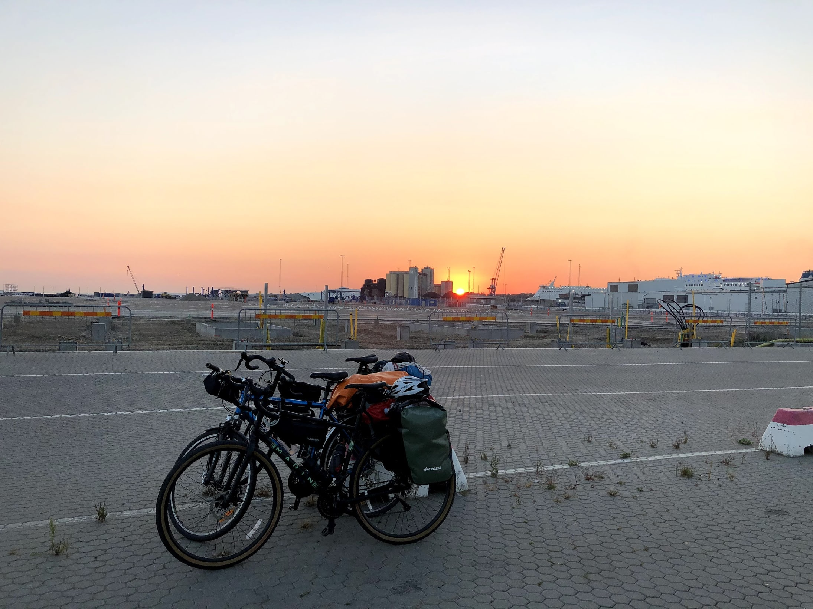
*Just before entering the return ferry.*