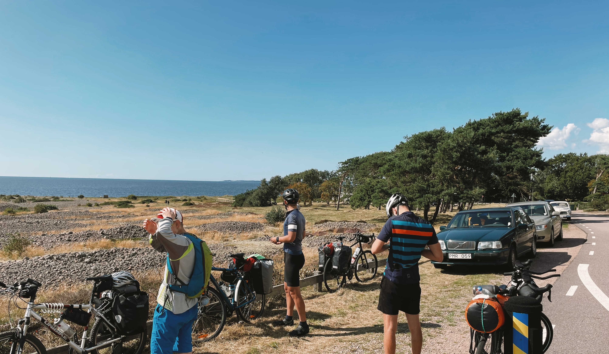
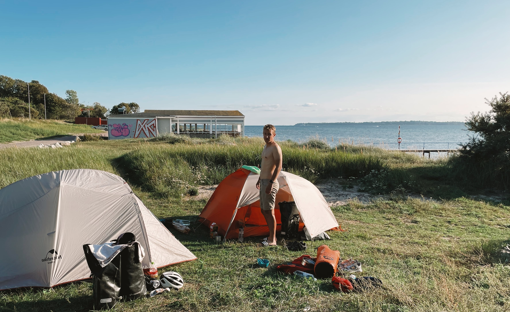

* [Photos](#image-gallery)
* [Route](#route)

In the summer of 2021, my friends and I spent a week on a bikepacking trip looping the **Kattegat** - a sea area bounded by the Jutlandic peninsula in the west and Sweden in the east. We started in Ystad, cycled through Gothenburg, took a ferry to Frederikshavn, Denmark and eventually closed the loop in Copenhagen.

Staying close to the sea meant that the route profile was rather flat with not that many hills, but at the same time it was windy and the weather could be unpredictable. Starting from Ystad we followed [the coastal bike path](https://visitsweden.com/what-to-do/nature-outdoors/biking/swedens-best-cycling-routes/) which got us through Malmö, Helsingborg, Halmstad and Gothenburg. The bikepacking-friendly "Everyman's Right" law allowed us to [camp in the wild](https://j.blaszyk.me/bikepacking-in-sweden/#wild-camping). We used [this website](https://campwild.org/) for finding camping spots. We spent two nights camping close to the sea, waking up to the sound of waves and brewing our morning coffee on the beach. We also camped in the wilderness shelter located at the lake in the forest close to Gothenburg ([map](https://map.campwild.org/places/4112)). The water in the lake was just great for a refreshing evening swim. During the first 3 days of cycling, we covered a distance of 440km, averaging almost 150km per day. On the 4th day, we got to Gothenburg where we took some time to rest and explore the city, in the afternoon we caught a ferry to Frederikshavn in Denmark.

On the other side of Kattegat, we were hit with harsher weather. It got colder and windy with some rainy days. Unfortunately, wild camping in Denmark is not allowed everywhere so we had to spend two nights in established campsites for a fee. However, there are several designated forests where wild camping is permitted, here is a useful [map](https://udinaturen.dk/map-page?scIds=1150,1303,1153&ffId=2468) for finding such spots. Danish bike paths led us from Frederikshavn along the coast to Hadsund, Randers and eventually Aarhus where we got our next ferry to [Sjællands Odde](https://www.google.com/maps/place/4583+Sj%C3%A6llands+Odde,+Denmark/@56.2359695,11.2544575,8.09z/data=!4m5!3m4!1s0x464db64c0f413e79:0x26a6d2afd1db110a!8m2!3d55.9671697!4d11.3667297), located about 100km away from Copenhagen.

Our bikepacking adventure concluded in Copenhagen, the capital city of Denmark. We took two days to immerse ourselves in the city’s vibrant life. Museums, great food or shops didn’t surprise us as much as the hippie “Free Town” Christiania. Located on an island within the city, it came to life as a squatted military area in the early 70s. This anarchist commune is somewhat independent of Danish regulations. It has its own rules, forbidding for example stealing and hard drugs. It means that the Green Light District, a cannabis market located on one of Christiania’s streets, can operate without disruptions 😎. I strongly suggest spending some time walking around and getting to know more about the history and [existing housing regulations](https://www.atlasobscura.com/articles/if-you-want-to-live-in-a-copenhagen-commune-get-ready-for-red-tape) which I find quite amusing since Christiania originated as a squatters utopia.

In total we spent 6 days on bikes, covering about 730km. We rode on gravel/touring bikes with 35-42mm tyres. For navigation, we used a mix of Komoot and bike route signs in Sweden, which worked out well very well. This trip not only got us around Kattegat, but it also marked our completion of cycling along the Swedish southern coastline (from Stockholm to Gothenburg). On our previous bikepacking trip we cycled from Stockholm to Ystad, that journey is described in another [blog post](https://j.blaszyk.me/bikepacking-in-sweden/).

<image-gallery></image-gallery>

## Route

<iframe src="https://ridewithgps.com/embeds?type=route&id=38412773&metricUnits=true&sampleGraph=true" style="width: 1px; min-width: 100%; height: 700px; border: none;" scrolling="no"></iframe>

